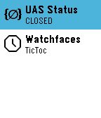
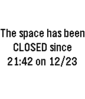

# UAS Status
A pebble smartwatch app to query the status of the unallocatedspace.org occupancy sensor

This is a Pebble app, written in a combination of C and JavaScript, which is largely based off the [One-Click Action / Lockitron tutorial](https://developer.pebble.com/guides/design-and-interaction/one-click-actions/) provided generously by the Pebble SDK devs.  The app itself is re-distributed in agreement with the [Pebble SDK license](https://developer.pebble.com/legal/sdk-license/).

This app runs on your Pebble smartwatch and queries the [Unallocated Space](www.unallocatedspace.org/uas) website to find out whether the [occupancy sensor](http://www.unallocatedspace.org/wiki/Occupancy_Sensor) has been triggered.

The app is my first, and was written for the older Pebble Steel platform (aka Basalt).  I have not tested it on other platforms, but it should work roughly the same way:

<kbd>
 
</kbd>

If the app hasn't been run recently, the glance will show "UNKNOWN" and the select button can be used to quickly check and report back the time of the last status change:

<kbd>

</kbd>

### Installation

You'll download compiled PBW file to your phone directly, then launch it (via a file manager or the Downloads app) which will trigger the Pebble app to install it.

Alternatively, you're welcome to download the source here and play around.  I was pleased with the [CloudPebble](www.cloudpebble.net) environment which provides an IDE, an emulator, and a streamlined way to push the app straight to your watch.

Contributions are heartily welcomed!
